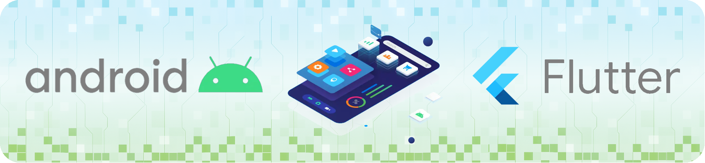

<!--
**adridiazvic/adridiazvic** is a ✨ _special_ ✨ repository because its `README.md` (this file) appears on your GitHub profile.

Here are some ideas to get you started:

- 🔭 I’m currently working on ...
- 🌱 I’m currently learning ...
- 👯 I’m looking to collaborate on ...
- 🤔 I’m looking for help with ...
- 💬 Ask me about ...
- 📫 How to reach me: ...
- 😄 Pronouns: ...
- ⚡ Fun fact: ...
-->

# 👋 Hello world! I'm Adrián

🎓 Junior Mobile Developer | Higher Technician in Multiplatform App Development  
📱 Passionate about creating mobile apps using **Flutter** and **Android**  
🚀 Always learning and building — this is just the beginning

---

## 🛠 Tech Stack

- **Languages:** Dart, Kotlin, Java
- **Frameworks & Tools:** Flutter, Android Studio, Visual Studio Code, Firebase, Git, Java Swing, JavaFX
- **Databases:** Firestore, Realtime Database, SQLite, Room  
- **Other:** BLoC, MVVM, REST APIs, Material Design, OOP, Hilt

---

## 📱 Featured Projects

- 🔹 **Cifras y Letras** – Real-time online multiplayer game for Android, developed as the final project during my studies  
- 🔹 **Dragon Ball App** – Flutter app developed during my internship  

---

## 🌱 Currently

- Looking for my **first job opportunity** as a mobile developer  
- Working on personal projects and constantly learning

---

> *"This is just the beginning 🚀"*
